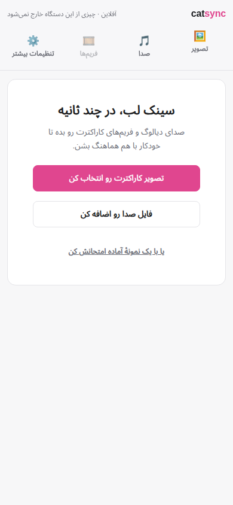
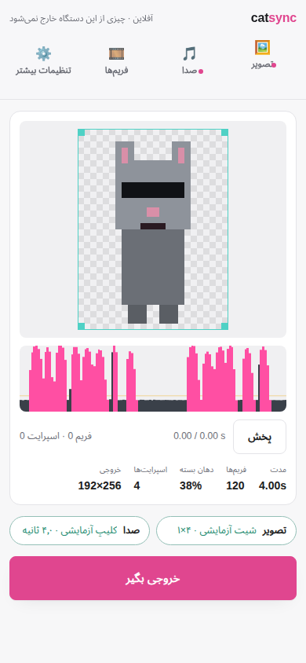
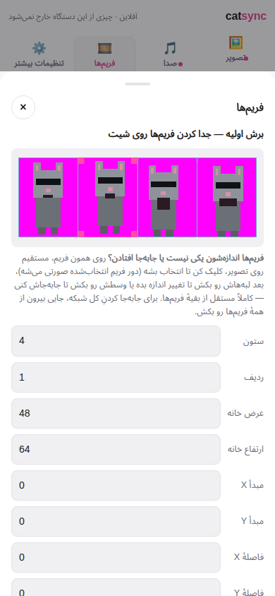
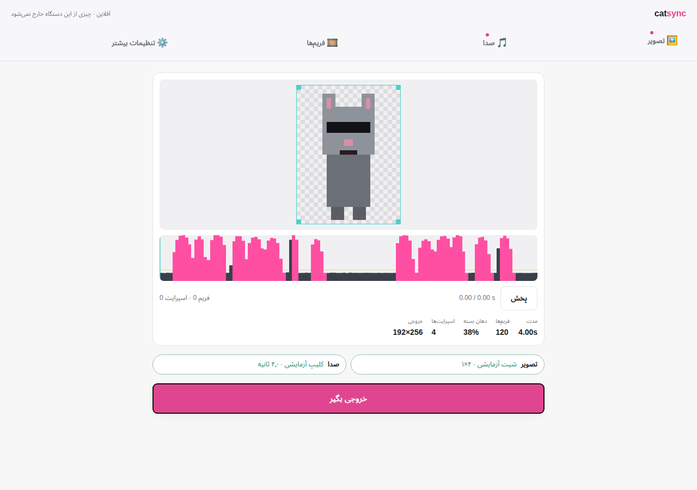
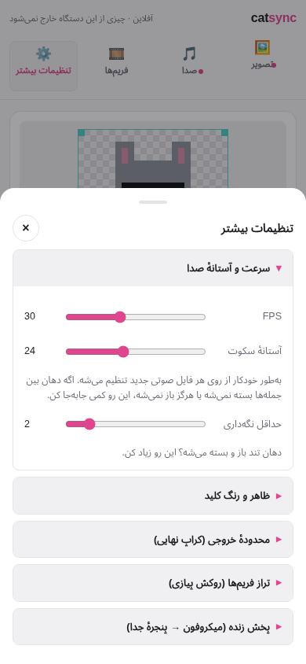
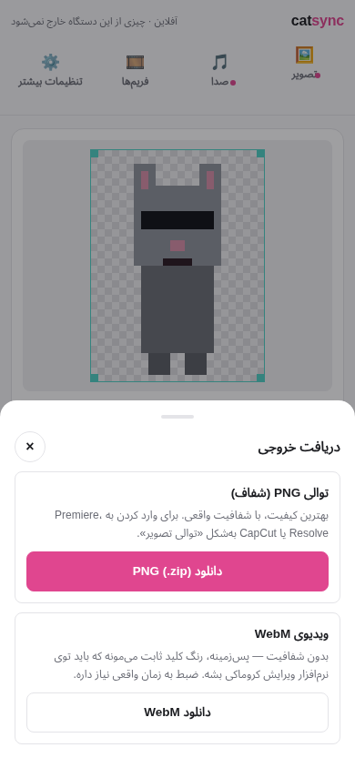

# catsync

Sprite sheet + audio → lip-synced animation, ready to drop over footage in your editor. Or point it at your mic and pop the cat out into its own window for a stream.

Or download the repo and open [`catsync.html`](catsync.html) — same app either way. Vanilla JS, no dependencies, no build step, no server. Nothing you load ever leaves your machine; there's no network code in it at all.

Built for the cats in a class video about compilers, which is why frame 0 is "mouth closed" and everything is pixel-art shaped. It works on any sprite sheet.

Repo layout: `catsync.html` (markup + toolbar/modal shell), `styles.css`, and `src/*.js` (one file per concern) are the app — see [ARCHITECTURE.md](ARCHITECTURE.md) for how the pieces fit together and why it isn't a framework or ES modules. `index.html` is just the landing page GitHub Pages serves at the root.

  
  
  

  

## About this fork

This is a fork of [alejandruxxug/Catsync](https://github.com/alejandruxxug/Catsync) ([live demo](https://alejandruxxug.github.io/Catsync/catsync.html)). All credit for the original design, the lip-sync algorithm, and the slicing/alignment/export pipeline goes to the original author — this fork's own writing is marked *(this fork)* below; everything else is the original project's documentation, describing logic that still works exactly as written.

Two rounds of changes on top of the original:

**A Persian interface, RTL, offline, single-license as before.** The UI is Persian by default (`<html lang="fa" dir="rtl">`), with numbers, coordinates and file names kept left-to-right and readable inside the RTL page.

**A redesigned, mobile-first workflow**, because the original single dense control panel — accurate and complete as it was — asked a first-time visitor to understand audio thresholds, viewport internals and grid geometry before they'd exported a single frame. This fork now separates a **simple path** (pick a character image, add audio, nudge a frame if needed, export) from **everything else**, reachable but out of the way:

- **A compact toolbar** (تصویر / صدا / فریم‌ها / تنظیمات بیشتر) replaces the old always-visible panel stack. Each button opens a focused sheet — bottom sheet on phones, centered dialog on desktop — for exactly one job.
- **The preview is the main thing on screen.** Until a sprite sheet is loaded, it's replaced by a two-button onboarding card; nothing else is shown before that.
- **Export is a primary, obvious action** — one pink button under the preview, "خروجی بگیر" — that opens a small dialog clearly separating the PNG sequence and the WebM export rather than burying both in a settings list.
- **Independent per-frame crop** lives in the simple path now (the **فریم‌ها** sheet): grid slicing is still the default, but any frame's X/Y/width/height can be nudged on its own afterwards, for sheets that don't come back perfectly uniform.
- **Everything technical** — sync thresholds, chroma keying, the exact viewport rect, onion-skin alignment, live mode — moved into one **تنظیمات بیشتر** (Advanced) sheet, organized as collapsible sections, first one open by default. The visual slicing grid itself stays in the simple **فریم‌ها** sheet, next to the per-frame crop editor — separating frames is core to the simple workflow, not an advanced tweak.
- **Broad resets ask first.** Resetting every frame's alignment or the whole slicing grid shows a small in-app confirmation instead of acting immediately or using a browser `confirm()`.
- A light, calm visual design replaces the earlier dark control-panel look — one accent color, generous spacing, no gradients or heavy shadows.

Nothing about the audio analysis, the mapping, the export formats, or the lip-sync algorithm changed in either round — only how you reach them.

## Use

1. Open the app. If you have nothing ready yet, tap **«با یک نمونهٔ آماده امتحانش کن»** to see the whole pipeline work first.
2. Tap **تصویر** and pick your talking sprite sheet — quietest frame first, widest last. The grid is guessed automatically.
3. Tap **صدا** and either drag in a WAV/MP3 or record straight into the page.
4. Press play, glance at the preview. If a frame's edges look wrong, open **فریم‌ها** and nudge that one frame's crop.
5. Press **خروجی بگیر** and pick PNG sequence or WebM.

Everything else — exact viewport pixels, chroma key tuning, onion-skin alignment, live mode — is one tap away in **تنظیمات بیشتر**, not in the way until you ask for it.

Or skip the audio entirely and hit **Go live** in Advanced — see [Live](#live), below.

## Recording

Hit **Record** and talk. The take goes straight into the pipeline, the level meter goes amber near clipping and red past it, and **Save take (.wav)** gets it onto disk — a recording lives in the tab and nowhere else until you do, which is why leaving the page asks you to confirm.

Three settings are explicitly turned **off** on the mic, and this matters more than it sounds:

- **Auto gain control** normalizes loudness over time. Loud-against-quiet *is* the lip sync signal, so AGC is actively erasing what's being measured — it's the one that ruins a take.
- **Noise suppression** gates room tone down to digital silence. The threshold is a hard gate placed relative to the noise floor, and a floor of exactly zero turns it into a cliff with nothing sensible to sit on.
- **Echo cancellation** is tuned for calls and colours the voice.

The mic is wired to the level meter and to nothing else — it never reaches your speakers, so there's no feedback loop and you don't need headphones.

**Takes are re-encoded to WAV before anything else touches them.** MediaRecorder writes a live-stream container with no length in its header — the same hole that made the WebM export come out short. An `<audio>` element handed one of those reports `Infinity` for duration and refuses to seek, which breaks the waveform and the scrubber. The samples are already decoded by that point, so writing a plain WAV with a real header costs nothing and sidesteps the entire class of bug. Mono, since the analysis reduces to mono anyway.

Recording needs a secure context. The hosted page is HTTPS so it's fine; from `file://` Chrome and Firefox allow it and Safari doesn't. Takes are capped at 10 minutes.

Frames must be ordered **quietest to loudest** — frame 0 is mouth closed, last frame is widest. Any count from 2 up works.

## Slicing

A sheet is not always `W/cols × H/rows`. Generated ones come back with a margin around the outside, gutters between cells, or a size that just doesn't divide evenly — and refusing all three, which is what the old slicer did, meant reaching for a pixel editor before you could start.

The grid is its own thing now: an **origin**, a **cell size**, and a **gutter**. Cols × rows only says how many cells to step through. The sheet is drawn with the grid on top, everything outside it dimmed and each cell numbered.

*(this fork)* **Click any frame directly on that sheet to select it** — same selection the thumbnail strip and the per-frame X/Y/width/height fields share — then drag its own edges to resize it or its body to move it, independent of every other frame. That's the primary way to fix one wrong cell; typing exact numbers is still there for precision. Dragging empty margin (outside every frame) moves the whole grid's origin instead, and arrow keys nudge whichever frame is currently selected.

Which control does what:

- **Cols, rows, gutter** refit the cells to the sheet. Whatever the margin and gutters leave over gets split evenly, so a grid never quietly runs off the edge because you asked for one more column.
- **Cell W/H and origin** are taken exactly as typed. Dragging never resizes; resizing never moves.

A grid that overhangs the sheet is allowed — the cells that fall outside come back partly empty rather than erroring, which is how you add padding. You get told when the grid overhangs, and when part of the sheet isn't covered.

**Auto-detect** reads the grid off the sheet instead of asking for it, and runs automatically on any sheet you drop. A column of pixels that's entirely background — key colour or already transparent — can't be inside a sprite, so the content runs between those columns are the cells; same for rows. It sets cols and rows too.

Two things it has to get right:

- A gap *inside* a sprite, between two legs say, would otherwise read as a cell boundary. Real gutters are the widest gaps on the sheet and roughly uniform, so anything under half the widest gap is treated as part of the sprite. No fixed pixel threshold — it scales with the sheet.
- Cell spacing comes from the first-to-last content run, which averages out the per-cell drift that generated sheets always have. Origin and cell size are then picked so every run fits inside its cell, so nothing gets clipped even when the drift is bad. If content is so uneven that cells would overlap, they're clamped to the spacing and you're told to check for a neighbour bleeding in.

If the sprites touch with no gutter at all it finds one blob, and falls back to trimming the outer margin and dividing that by the cols you asked for. If the whole sheet reads as background, the key colour is wrong — fix it in **Look** and detect again.

The demo loads a deliberately even grid, because auto-detect would trim it down to the sprites and hide the drift the align panel exists to fix.

## Independent per-frame crop *(this fork)*

The grid gives every cell the same size, which is right for a hand-drawn sheet but not always for a generated one — frame 2 might genuinely be 96px wide where its neighbours are 120px. Grid slicing stays the initial, default step; on top of it, each frame now carries its own crop rect that can be nudged independently, without touching any other frame.

Open the **فریم‌ها** (Frames) sheet, pick a frame from the thumbnail strip, and adjust **X / Y / width / height** — the frame's own rect on the original sheet (sheet pixels, independent of the grid). Editing them re-cuts just that one frame; every other frame, the grid, the alignment offsets and the viewport are untouched. The reset button there puts it back to whatever the grid currently says that cell should be. (Alignment — nudging a frame's onion-skinned *position*, as opposed to its crop rect — is a separate, more occasional fix and lives in Advanced → تراز فریم‌ها; see below.)

This sits *between* slicing and alignment in the pipeline — sheet → grid slicing → **per-frame crop** → alignment → viewport → export — so it composes with everything downstream: alignment offsets, the viewport, playback, PNG export, WebM export and Live mode all read the frame's actual (possibly resized) canvas, the same way they already did for a plain grid cell. Changing the grid (cols, rows, cell size, origin, gutter) rebuilds every frame's rect from scratch, so a per-frame tweak is scoped to the grid it was made against.

## Align — onion skin

Image models can't hold a sprite pixel-identical across cells, so generated sheets come back with each frame shifted a little. Fix it here instead of round-tripping through a pixel editor.

Click any frame in the strip to select it. The reference frame is ghosted underneath — drag the sprite, or focus the canvas and use arrow keys (shift = 4px). Offsets are whole pixels and apply to the preview and every export.

- **Ghost / Difference** — Difference blend makes a misalignment obvious; anything still lit up is off.
- **Reference** — frame 0 (everything anchors to one frame) or previous (chains down the strip).
- **Auto-align** — searches for the shift that best matches the reference, weighting the silhouette heavily since the mouth is the one part allowed to differ.

The search window is 6% of sprite size, and on anything above 192px the matching runs on a downscaled copy — otherwise the cost, which is (2R+1)² × pixels, freezes the tab on a high-resolution sheet. Precision ends up relative rather than absolute: exact at 48px, within 4px at 1024px, which is 0.4% and invisible once composited. Measured 44–108ms per frame from 48px to 1024px. Arrow keys give you exact control if you want it.

**Every frame can be moved, frame 0 included.** It's still the alignment reference, but locking it meant a sprite clipped by the viewport edge could never be pulled back into frame. Tick **Move all frames together** to reframe the whole set without disturbing the relative alignment between frames — auto-align keeps working afterwards, since it positions each frame relative to wherever the reference currently sits. Offsets are clamped to one cell in each direction so a runaway drag can't lose a sprite off-screen.

The demo sheet ships with deliberate drift on cells 1–3 so you can see the feature work.

## Viewport

The exported frame is a window onto the cell, not the whole cell — trim dead space or reframe to head-and-shoulders. It's outlined in teal on the align canvas, with everything outside dimmed.

**Drag it on the preview.** That's the one that matters: hit Play and reframe against the animation actually running, rather than against one still frame in a small panel. It's also draggable on the align canvas, where it sits next to the onion skin. Same gesture either way:

- **Any edge or corner** resizes that side of the cut. The left edge moves the left boundary and leaves the right one exactly where it was, which is what trimming dead space off one side actually needs. Corners take two sides at once. Four teal grips mark them, and the cursor tells you which you're on before you press.
- **Shift-drag** the same edge or corner moves the whole cut without resizing it — for sliding a fixed output size around.
- **Anywhere else** moves the sprite on the align canvas, and does nothing on the preview — aligning belongs in the align panel.

The preview is draggable only while the cut is **unlocked**, because locking it makes the preview *become* the cut and there's nothing outside it left to grab. Unlock, reframe, lock to check.

The cut is worked as four edges rather than as x/y/w/h, because clamping position and size separately would let a dragged edge slide its opposite. An edge stops one pixel short of the one across from it instead of passing through into a mirrored rectangle. Grips are pulled back inside the canvas when the cut is bigger than the cell, so an oversized cut whose corners are off in space is still grabbable.

For exact numbers, set X/Y/W/H in sprite pixels, or hit **Fit to content** for the union bounding box of every frame's opaque pixels with 1px padding. Typed and dragged values run through the same clamp, so neither can reach a size the other can't.

**The cut isn't applied while you edit.** Until you tick **Lock the cut**, the preview shows the whole frame with the viewport drawn as a guide — dimmed outside, teal outline — so a sprite you're dragging stays visible even when it currently falls outside the crop. Lock it to see the real cut. Either way, **exports always apply the viewport**; the lock only changes what the preview shows. The **Output** stat always reports the exported size, never the preview's.

The viewport applies after alignment, so align first, then frame.

## Display vs export size

**Fit preview to window** (on by default) scales the preview down to fit — display only, it never touches what you export. The **Output** stat under the preview always shows the real exported pixel size, which is the viewport dimensions × **Scale**. If the exported PNGs come out a size you didn't expect, that readout is the one to trust.

## Exports

**PNG sequence (.zip)** — the real one. Numbered transparent PNGs, import into Premiere / Resolve / CapCut as an image sequence. Exact alpha.

**WebM** — no transparency. Browsers can't record an alpha channel, so the key color is baked in as a solid background for you to chroma-key. Records in real time, so a 60s clip takes 60s.

Three things had to be handled to get the length right:

- MediaRecorder writes a *live-stream* WebM — the Segment has unknown size and Info carries no Duration element, since the length isn't known when recording starts, and nothing backfills it on stop. Players then guess from cluster timecodes and often guess low, which is what makes clips look short. We know the exact length, so it's written into the container afterwards. If the file has a SeekHead or Cues, inserting bytes would invalidate their offsets, so the patch is skipped and you get a warning instead of a broken file.
- Frames are emitted explicitly via `requestFrame()` on a wall-clock timer. On auto-capture the canvas is only sampled when it happens to be dirty, and rAF throttles to ~1fps in a background tab, so the cadence silently collapses.
- Recording now arms before playback starts, with a primed first frame — previously the gap between `play()` resolving and the recorder starting was lost off the front.
- **The encoder can fall behind realtime**, badly, on a large canvas — frames queue inside it and `stop()` discards whatever hasn't been written, silently cutting seconds off the end. Wall-clock time can't see this, so progress is now read out of the stream itself: every Cluster carries an absolute Timecode, and the highest one seen is how far encoding has genuinely got. Recording doesn't stop until that catches up to the target (with a stall detector and a hard cap so it can't hang). Bitrate scales with frame size instead of a flat 8Mbps, and VP8 is preferred over VP9 since it encodes much faster in realtime. If it still comes up short you get told exactly how short and why, rather than a quietly truncated file.
- The encoder needs a moment to flush after the last frame, and going silent during that window leaves recorded time with no frames in it, which players render as a held frame. That produced a ~0.33s freeze at the end of every clip — absolute, not proportional, so it read as "the animation stops just before the end." The final frame is now re-emitted throughout the flush, and the duration written into the container is the length actually measured rather than the theoretical one.

Still, the PNG sequence is the dependable export. Use WebM for quick checks.

## Live

**Go live** points the mic at the cat and puts it in a window of its own, animating in realtime. No audio file, no export step — add that window to OBS as a **window capture**, chroma-key the background, and it's a mouth that moves when you talk. It only needs a sprite sheet; everything about the audio side is skipped.

In that window, **–** hides the control bar and shrinks it to exactly the cat, so there's nothing to crop out. **Fit** sizes it 1:1, **h** toggles the bar, **Esc** stops. Drag the window's edge and the cat scales to fill it — nearest-neighbour, so pixel art stays pixel art, though only *Fit* lands on whole pixels. The background is the key colour by default, the same thing the WebM export bakes in; green, black, and a checkerboard (for eyeballing alpha, not for capturing) are also there.

**The threshold is set from your room automatically** when you go live, and again whenever you hit **Set threshold from room tone**. This is not optional politeness. Live has no file to measure, and with a fixed default a quiet room read as speech on **299 of 300 frames** in testing — the cat flapping at nothing. A second of listening dropped that to zero. Recalibrate when the room changes; a fan coming on is a different room.

Two things work differently from the batch path, both because there is no future to look at:

- **Loudness is normalized against a peak follower, not the 95th percentile of the file.** It rises toward a loud frame by a quarter of the distance per frame and falls back at 2dB/s. The soft attack is what stops one door slam setting the bar for the next ten seconds — the job the 95th percentile does when the whole file is available. And the reference is floored at a plausible speaking level rather than at silence: let it decay all the way down in a quiet room and it renormalizes the room's own hiss up to "shouting".
- **The mapping is stepped on the fps grid, not the display's refresh rate.** Otherwise *min hold 2* would mean 2/60s on one machine and 2/30s on another, and settings that looked right live would look wrong in an export. It's the same state machine the batch path walks, called one frame at a time, so the two can't drift apart.

The frame loop runs on the **pop-out's** animation clock rather than the main page's. A background tab is throttled to about 1fps, and the whole point is that the editor can sit behind OBS while the cat keeps moving. Keep the pop-out somewhere visible, though — a browser stops drawing a window that's minimized or completely covered, and no capture can fix that.

Live and **Record** share one microphone, so starting either stops the other, and playback pauses when you go live — otherwise the speakers feed the mic.

**Reframing while live works.** Drag any edge of the viewport on the align canvas and the pop-out follows as you go; the window around it resizes when you let go rather than on every pixel, so it isn't jittering about while you're still deciding. Same for the X/Y/W/H boxes: the cat reframes as you type, the window snaps once you commit.

## The three settings that matter

**Silence threshold** — auto-set from each new file's noise floor, which is the only sane default since it depends on your mic and room. It's a hard gate, so it flips suddenly rather than sliding: on a test clip, 18 → 20 moved mouth-closed from 3% to 40%. Nudge in small steps.

**Min hold** — how many frames a mouth shape must stay before it can change. 2 at 30fps is a good start. Too low, the mouth strobes. Too high, it lags the words. On the demo, raising hold from 1 to 4 cut mouth changes from 37 to 20.

**Mouth closed %** — the readout that tells you if the other two are right. A normal take of continuous speech should land somewhere around 30–40%. If it reads 2%, the mouth never closes between sentences and your threshold is too low.

## How the sync works

Amplitude-driven, not phoneme-driven. Loud = open, quiet = closed.

Audio is downmixed to mono, split into one window per video frame, and each window's RMS is converted to dB. That's normalized against the **95th percentile** of non-silent frames rather than the peak, so one loud pop doesn't squash the rest of the take. The 0–100 result maps into equal bands, one per sprite. Hysteresis stops values sitting on a band edge from chattering; minimum hold stops strobing.

Real phoneme lip sync needs a transcript, and the cats are small on screen. This reads fine.

## Persian interface, workflow & mobile layout *(this fork)*

The interface is Persian by default (`<html lang="fa" dir="rtl">`) — there's no language switcher, since this fork targets Persian-speaking users specifically. Prose, labels, hints and every status/error/export message are in Persian, written as a Persian-speaking product designer would phrase them rather than translated word-for-word; numeric fields, coordinates, `dx`/`dy` readouts, file names and frame indices stay left-to-right (`direction: ltr` scoped to those elements) so a value like `-12` or `catsync_120f_30fps.zip` reads correctly inside the RTL page. No web font is loaded — that would need a network fetch and break offline use — so Persian text renders with the system's own UI font (Tahoma / Segoe UI / the OS default).

**The workflow is split into a simple path and an Advanced sheet**, on the premise that a first-time visitor should understand what to do within seconds, without reading about audio thresholds or viewport internals first. A compact toolbar (تصویر / صدا / فریم‌ها / تنظیمات بیشتر) replaces the old always-visible stack of panels; each button opens one focused sheet — a bottom sheet under 640px, a centered dialog above it, same markup either way, `styles.css` just switches the layout. The preview stays the dominant thing on the main screen at all times; before a sprite sheet is loaded it's replaced by a two-button onboarding card instead of an empty canvas and forty settings. Export is one pink button under the preview that opens a small dialog distinguishing the PNG sequence from the WebM export, rather than one more item in a settings list.

  
  

Inside Advanced, sections are native `
`/`
` accordions rather than custom JS toggles — sync/threshold settings open by default, chroma keying / final viewport crop / onion-skin alignment / live mode collapsed. That's also what keeps a stray tap from reaching a control you didn't mean to touch: a `
` only ever toggles its own section, never something nested inside it. The one thing that's *not* in Advanced is slicing itself: the visual, draggable grid that actually separates the sheet into frames lives in the **فریم‌ها** sheet, always visible, right above the per-frame crop editor — it's the more fundamental of the two "manual frame" tools, so it stays in the simple path rather than behind one more tap. The whole layout is designed mobile-first from 360px up through desktop, with 44px-minimum touch targets, wrapping rows, and no control that can force horizontal scrolling.

Two reset actions are broad enough to lose real work — **Reset all offsets** (every frame's alignment) and **Reset to even grid** (the whole slicing grid, including any per-frame crop) — so both are visually set apart from the normal buttons (a dashed "danger zone" divider, a distinct color) and ask for confirmation in a small in-app dialog before doing anything, instead of a browser `confirm()` popup or no confirmation at all.

## Notes

- Changing threshold, hold, or scale only redoes the cheap mapping step — the audio is decoded and analyzed once.
- Scaling is nearest-neighbour only. Blurred pixel art is a failed render.
- Keying defaults to a hard cutoff, because soft edges look wrong on true pixel art. **Feather** (in Look) softens it for anti-aliased or high-resolution sprites — alpha ramps from the tolerance distance out to tolerance + feather.
- **Despill** removes the key-colour fringe that feathering exposes. It only touches partly-transparent pixels, scaled by how transparent they are, so opaque interior colours are never altered — a genuinely pink nose survives a magenta key. It desaturates toward each pixel's own mean rather than clamping the key's dominant channels: with magenta those are R and B, so clamping collapses toward the lone dark G channel and leaves a dark halo. Pivoting on the mean holds luminance exactly and just drains the colour cast.
- Record **one long WAV per script segment**, not per line. Fewer passes, and the normalization is steadier across a whole take.

## License

MIT — see [LICENSE](LICENSE), unchanged from the original project. Take it, change it, ship it.

Original project: [alejandruxxug/Catsync](https://github.com/alejandruxxug/Catsync), MIT licensed. This fork modifies `catsync.html` and this README; the original author's copyright notice in [LICENSE](LICENSE) is preserved as-is.
